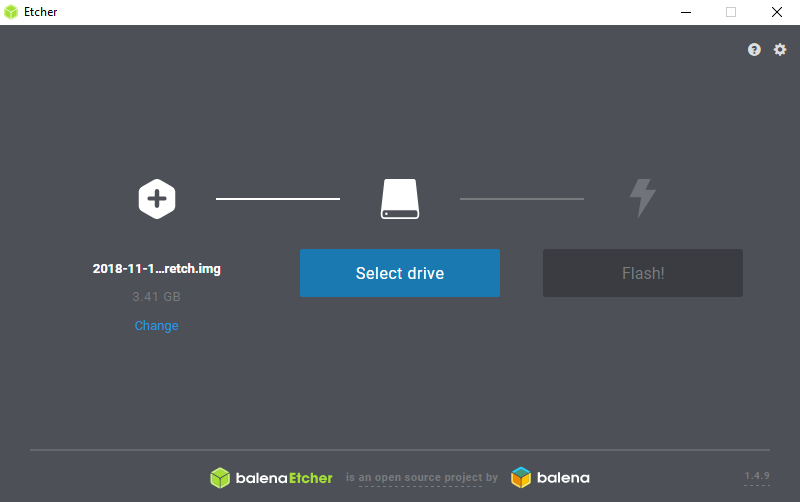

# Contents
* [Project Introduction](#catalyst-jukebox)
* [Setup](#setup)
* [Running the Jukebox](#running-the-jukebox)
* [Contributing](#how-to-contribute)
* [Contact](#contact)
* [Other Media](#other-media)
* [License](#license)

---

# Catalyst Jukebox
#### *A modern jukebox with a focus on social interactions*
## What is it?

## Why should I care?


does it have links to other important documentation?  


# Setup

## Hardware
  
  

Here is a list of hardware I have used for this project:
* [Raspberry Pi 3 Model B](https://www.raspberrypi.org/products/raspberry-pi-3-model-b/) for the server and Spotify audio device
* [5 inch touch screen](https://www.ebay.com.au/itm/5-Inch-LCD-Touch-Screen-HDMI-Display-800-480-Raspberry-Pi-3-2-eParcel-Sydney/152408334219?ssPageName=STRK%3AMEBIDX%3AIT&_trksid=p2057872.m2749.l2649) for the Raspberry Pi to display QR codes and other information, you can also choose to forgo the screen if you'd like  
*Note: any screen is probably fine, however this is a generic model and as such I don't have a better link, so this is the exact one I used*
* [Sparkfun ESP32 Thing](https://www.sparkfun.com/products/13907) as the location device *(also referred to as the 'restaurant pager/buzzer')*  
*Note: any ESP32 is probably fine, however this one has LiPo charging and power already implemented which is nice*
* Components
    * Resistors (Ω)
        * 1K (x1)
        * 220 (x4, more if you want more LEDS)
        * ~3K3 (x1)
        * ~2K (x1)
    * Diode (x1, IN4002 or similar)
    * Capacitor (x1, 0.1 µF)
    * Transistor (x1, 2N2222 or similar)
    * LEDS (x4, I used Red, Green, 2 Blue)
    * 3V Vibration Motor (x1)
    * Buzzer (x1)
    * Momentary Button (x1, I used an illuminated model)
    * LiPo Battery (x1)
    * Protoboard or Breadboard etc.
    * Some way to connect everything (wires, solder, jumper cables, hearders etc.)

## Configuring Raspberry Pi
### Set up the Pi
1. Download the [Raspbian Desktop](https://www.raspberrypi.org/downloads/raspbian/) image from the [Raspberry Pi Website](https://www.raspberrypi.org/)

2. Flash the image to an SD card (windows method follows)
    * Download and install [etcher](https://www.balena.io/etcher/)
    * Flash the raspbian image to a microsd card (preferrably 8GB+) using etcher  
    

3. Boot the Raspberry Pi
    * Update software
    * Enable ssh, set hostname, enable networking, locale etc.  

### Install relevant software
On the Pi:  

1. Clone the [Catalyst Jukebox repo](https://github.com/bschuetze/catalyst-jukebox)  
(install git if needed `sudo apt install git`)

2. Install [Raspotify](https://github.com/dtcooper/raspotify)  
`curl -sL https://dtcooper.github.io/raspotify/install.sh | sh`
    * (optional) update the config `/etc/default/raspotify`

3. Install [Node.js](https://nodejs.org/en/)  
`sudo apt-get install nodejs`

4. Install [npm](https://www.npmjs.com/)  
`sudo apt-get install npm`

5. Install [mosquitto](https://mosquitto.org/)  
    * `sudo apt install mosquitto`  
    * `sudo apt install mosquitto-clients`
    * Run as a service:  
    `sudo systemctl enable mosquitto.service`

6. Install / [Upgrade to Python 3](https://cs.anu.edu.au/courses/china-study-tour/news/2019/02/01/brents-update-blog-05/#python)

7. Install [pipenv](https://pipenv.readthedocs.io/en/latest/)  
`pip install --user pipenv`

8. `cd` in to the `device-monitoring` folder in the catalyst-jukebox repo you cloned

9. Run `pipenv install` to install the required packages listed in the `Pipfile`
    * Also install RPI.GPIo which wouldn't work with pipenv using  
    `pip install RPi.GPIO`

10. Install all the required Node.js modules
    * `npm install ip` [https://www.npmjs.com/package/ip](https://www.npmjs.com/package/ip)
    * `npm install biguint-format` [https://www.npmjs.com/package/biguint-format](https://www.npmjs.com/package/biguint-format)
    * `npm install node-fetch` [https://www.npmjs.com/package/node-fetch](https://www.npmjs.com/package/node-fetch)
    * `npm install serve-favicon` [https://www.npmjs.com/package/serve-favicon](https://www.npmjs.com/package/serve-favicon)
    * `npm install request` [https://www.npmjs.com/package/request](https://www.npmjs.com/package/request)
    * `npm install image-downloader` [https://www.npmjs.com/package/image-downloader](https://www.npmjs.com/package/image-downloader)

11. Get the local IP of the PI  
    * Run `ifconfig` from the CLI on the Pi and locate the local IP  
    


### Connect the screen
On the Pi:  
1. Clone the LCD driver repository at the [LCD-show](https://github.com/goodtft/LCD-show) repo
2. `cd` into the LCD-show directory
3. For this specific screen, we will use the 'LCD5-show' script
4. Run `chmod 744 LCD5-show` to make the script executable
5. Run the script with `sudo ./LCD5-show`  
*Note: your Pi may restart after running this script*  

At this point the Pi should be all ready to go, now plug in the screen via the header like so:  
*Note: the following 2 images were provided in some of the 'documentation' with the screen and are not my own*  
  
and then attach the included hdmi connector:  
  
and you should have display!  
  

### Calibrate the screen
1. If not already, boot into the visual display from headless mode with `startx`
2. `cd` into the LCD-show directory you cloned in the [previous section](#connect-the-screen)
3. Run `sudo dpkg -i -B xinput-calibrator_0.7.5-1_armhf.deb` and wait for it to finish
4. Run the calibrator with `DISPLAY=:0.0 xinput_calibrator` and follow the prompts on the screen with the stylus
    * once finished the screen should output something like this:  
    ```
    Calibrating standard Xorg driver "ADS7846 Touchscreen"
    current calibration values: min_x=0, max_x=65535 and min_y=0, max_y=65535
    If these values are estimated wrong, either supply it manually with the --precalib option, or run the 'get_precalib.sh' script to automatically get it (through HAL).
    --> Making the calibration permanent <--
    copy the snippet below into '/etc/X11/xorg.conf.d/99-calibration.conf' (/usr/share/X11/xorg.conf.d/ in some distro's)
    Section "InputClass"
    Identifier  "calibration"
    MatchProduct    "ADS7846 Touchscreen"
    Option  "MinX"  "3049"
    Option  "MaxX"  "63589"
    Option  "MinY"  "3108"
    Option  "MaxY"  "63287"
    Option  "SwapXY"    "0" # unless it was already set to 1
    Option  "InvertX"   "0"  # unless it was already set
    Option  "InvertY"   "0"  # unless it was already set
    EndSection
    ```
    * This may be the new way of formatting the file, however mine did not work, instead I followed a different calibration value using the tool below
5. Install evtest with `sudo apt-get install evtest`
    * Run evtest with `sudo evtest`
    * Touch the top left of the screen with the stylus and note the x and y values of the second to last line (the non 0 values)
    ```
    Event: time 1547204968.948348, -------------- SYN_REPORT ------------
    Event: time 1547204968.968264, type 3 (EV_ABS), code 0 (ABS_X), value 183
    Event: time 1547204968.968264, type 3 (EV_ABS), code 1 (ABS_Y), value 299
    Event: time 1547204968.968264, type 3 (EV_ABS), code 24 (ABS_PRESSURE), value 65114
    ```
    * Repeat for the bottom right hand side
    ```
    Event: time 1547205103.758308, -------------- SYN_REPORT ------------
    Event: time 1547205103.778335, type 3 (EV_ABS), code 0 (ABS_X), value 3916
    Event: time 1547205103.778335, type 3 (EV_ABS), code 1 (ABS_Y), value 3947
    Event: time 1547205103.778335, type 3 (EV_ABS), code 24 (ABS_PRESSURE), value 64952
    ```
    * Based on these results my values are as follows:
    min_x: 183
    min_y: 299
    max_x: 3916
    max_y: 3947
6. Using these values, we can edit the configuration file with:  
`sudo nano /etc/X11/xorg.conf.d/99-calibration.conf`  
to look like this:  
```
Section "InputClass"
 Identifier      "calibration"
 MatchProduct    "ADS7846 Touchscreen"
 Option  "Calibration"   "183 3916 299 3947"
 Option  "SwapAxes"      "0"
EndSection
```
7. To ensure this works with newer versions of raspbian run:  
`sudo apt-get install xserver-xorg-input-evdev`
8. Then:  
`sudo cp -rf /usr/share/X11/xorg.conf.d/10-evdev.conf /usr/share/X11/xorg.conf.d/45-evdev.conf`
9. Finally, reboot the Pi with `sudo reboot`  

Your screen should now be calibrated correctly!

## Configuring Restaurant Pager (ESP32)
### Flashing Software
*Note:* If you're using Windows then you may need drivers for the ESP32, if you're using the 'Thing' like I am then you'll need [FTDI Drivers](https://www.ftdichip.com/Drivers/VCP.htm), other boards may need [something else](https://www.silabs.com/products/interface/usb-bridges/classic-usb-bridges/device.cp2102).  

1. If you don't have it already, install [Python 3](https://realpython.com/installing-python/)

2. Install the [ESPTool](https://github.com/espressif/esptool) with pip using `pip install esptool`

3. Download the [ESP32 micropython firmware](http://micropython.org/download#esp32)

4. Download the uPyCraft IDE
    * [Windows](https://randomnerdtutorials.com/install-upycraft-ide-windows-pc-instructions/)
    * [Mac](https://randomnerdtutorials.com/install-upycraft-ide-mac-os-x-instructions/)
    * [Linux](https://randomnerdtutorials.com/install-upycraft-ide-linux-ubuntu-instructions/)

5. Plug the ESP32 into your computer and find its location (the upycraft links will have some information on this, for me it is COM3 on Windows)

Note: Step 6 and 7 can be done from uPyCraft, however mine only worked intermittently whereas the normal methods worked every time, you can try that method if you want to [here](#flashing-with-upycraft).

6. Erase the existing flash with:  
`esptool.py.exe --chip esp32 -p COM3(YOUR PORT) erase_flash`  
*Note: windows uses esptool.py.exe, it will be different on Linux and Mac*

7. Write the new micropython firmware you just downloaded to the board with:  
`esptool.py.exe --chip esp32 -p COM3(YOUR PORT) write_flash -z 0x1000 /path/to/firmware.bin`

#### Flashing with uPyCraft
1. Select BurnFirmware  


2. Enter the following settings in the popup (your port will differ as well as firmware name)  


3. Wait for the burn to complete  


### Uploading Program

1. Open the uPyCraft IDE

2. Ensure that the board is set to ESP32  


3. Under serial, select the same port as you found your board to be on before  


4. If all is well, you should see a terminal at the bottom with >>>  


5. Enter your wifi password in the utils.py file  


6. Save that file and drag and drop it onto the 'device' on the left, once you have done that it should upload to the board  


7. Next we open the main.py file and update the WIFI_SSID to the name of your network and update the JUKEBOX_IP to the local IP of the julebox we [found earlier] TODODODODODODODO  


8. Upload that file using the 'play' button on the right  
  


## Wiring
Note: when wiring up the boards, *especially* if soldering, please ensure that all power sources are disconnected

### ESP32 Wiring Diagram
  
[Circuit Link](https://www.circuit-diagram.org/circuits/c1606980)

### Pi Wiring Diagram
  
[Circuit Link](https://www.circuit-diagram.org/circuits/e828d5e3)


# Running the Jukebox
After completing the [setup](#setup) section, you're ready to

# How to Contribute
If you wanna contribute to this project, great! If you want to collaborate or have any questions, please feel free to [get in touch](#contact) and we can work something out, otherwise you can make [make a pull request](https://help.github.com/en/articles/creating-a-pull-request) for me to merge any small changes you'd like to make.


# Contact
Any enquiries feel free to contact me on: [brent.schuetze@anu.edu.au](mailto:brent.schuetze@anu.edu.au)


# Other Media
Find my blogposts on the build over at the [China Study Tour](https://cs.anu.edu.au/courses/china-study-tour/news/#brent-schuetze) website  
My [YouTube Channel](https://www.youtube.com/channel/UCcbzaG6yzkxIH_NWM2gUyig)


# License
This software is released uner the [MIT License](LICENSE.md)

Used Libraries and other sources:  
* [Spotify Developer Terms of Service](https://developer.spotify.com/terms/)
* [Raspotify](https://github.com/dtcooper/raspotify) released under MIT
* p5.js was created by [Lauren McCarthy](http://lauren-mccarthy.com/) and is developed by a community of collaborators, with support from the [Processing Foundation](http://processing.org/foundation/) and [NYU ITP](http://itp.nyu.edu/itp/)
* [Node.js license](https://raw.githubusercontent.com/nodejs/node/master/LICENSE)
    * [ip](https://www.npmjs.com/package/ip): MIT
    * [node-fetch](https://www.npmjs.com/package/node-fetch): MIT
    * [serve-favicon](https://www.npmjs.com/package/serve-favicon): MIT
    * [request](https://www.npmjs.com/package/request): Apache-2.0
    * [image-downloader](https://www.npmjs.com/package/image-downloader): MIT
* [NPM Terms of use](https://www.npmjs.com/policies/terms)
* [Python RPI.GPIO](https://pypi.org/project/RPi.GPIO/): MIT
* [Python requests](https://pypi.org/project/requests/): Apache-2.0
* [Python pyudev](https://pypi.org/project/pyudev/): GNU
* [Python paho MQTT](https://pypi.org/project/paho-mqtt/): OSI Approved


does it say how to contact you?  
is there an opportunity for others to contribute—and an explanation for how they might get involved?  